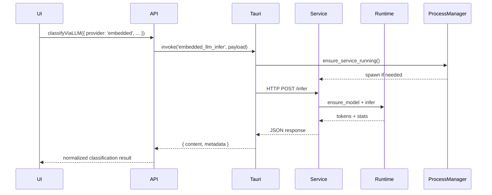

# Embedded LLM Architecture

## Goals

- Ship with a sensible default model source (Qwen2.5-0.5B-Instruct-GGUF from Hugging Face) and download location.

## High-Level Components

| Component | Responsibility |
|-----------|----------------|
| **Model Registry** | Manages metadata about locally available GGUF models (name, path, size, last-used). Persists state in `~/.file-organizer/models.json`. |
| **Model Downloader** | Handles downloading GGUF artifacts from configured sources (direct URL or registry). Streams progress, verifies checksums, and stores into the registry. |
| **Embedded Runtime (Rust)** | Thin wrapper around `llama_cpp` that loads a selected model, exposes `ensure_model` and `infer` helpers, and tracks statistics. Lives in `src-tauri/src/embedded_llm.rs`. |
| **Background Service** | Long-running subprocess (Tauri sidecar) that hosts the runtime, exposes a lightweight JSON-RPC/HTTP API, and guarantees thread isolation. Starts/stops via a `ProcessManager`. |
| **Process Manager** | Tauri command layer that supervises the sidecar lifecycle: spawn, readiness checks, restart on crash, shutdown. Exposes status events to the UI. |
| **Frontend Provider Adapter** | New `embedded` provider in `api.ts` that proxies classification requests to the background service and normalizes responses. |
| **UI Controls** | Additions to `LLMConfigPanel` that let the user pick/download models, see status, and start/stop the embedded service. |

## Process Flow



## Embedded LLM Service API

All requests use JSON POSTs over `http://127.0.0.1:<port>/` (port determined at launch).

### `POST /status`

- **Request:** `{}`
- **Response:** `{ ready: bool, model?: string, uptime_s: number }`
- Used by the Process Manager for health checks.

### `POST /load`

- **Request:** `{ model_path: string, options?: { context_length?, gpu_layers?, seed? } }`
- **Response:** `{ loaded: true, stats: { load_ms, context_length } }`
- Loads or hot-swaps the active model; calls `ensure_model` internally.

### `POST /infer`

- **Request:** `{ prompt: string, temperature?, top_p?, max_tokens? }`
- **Response:** `{ content: string, prompt_tokens: number, completion_tokens: number, latency_ms: number }`
- Performs a single completion using the currently loaded model.

### `POST /download`

- **Request:** `{ url: string, sha256?: string, target_name?: string }`
- **Response:** `{ started: true, id: string }`
- Streams progress events back through Tauri event emitter (`embedded-download-progress`).

## Lifecycle Management

1. **Startup**
   - UI requests provider status via `api.ts`.
   - Process Manager launches the sidecar if missing and waits for `/status` = ready.
2. **Model Selection**
   - User picks an existing model or triggers download.
   - Coach `ProcessManager` to call `/load` with selected model path.
3. **Inference**
   - `classifyViaEmbeddedLLM` ensures service + model loaded, forwards `/infer` request, and normalizes output.
4. **Shutdown**
   - On app exit, Process Manager sends `/shutdown` (future endpoint) and waits for graceful termination.

## Error Handling & Fallbacks

- **Service spawn failure** → surface message in UI & revert to previous provider; optionally retry with backoff.
- **Model load failure** → emit descriptive error (path missing, unsupported format) and keep previous model active.
- **Inference timeout** → configurable timeout (default 45s) in `api.ts`; on timeout fall back to cloud/local provider chain.
- **Download errors** → propagate progress failure events with actionable reason (network, checksum mismatch, disk full).
- **Resource limits** → detect OOM / GPU layer incompatibility via `llama_cpp` error and present remediation tips.

## Directory Layout Changes


```text
src-tauri/
  src/
    embedded_llm.rs          # runtime helpers (already implemented)
    embedded_llm_service.rs  # Axum/Warp based HTTP service (to be added)
    process_manager.rs       # supervises sidecar(s)
  sidecars/
    embedded-llm-service/    # background binary source (new Cargo crate)
```

Frontend additions:

```text
src/
  api.ts                    # Embedded provider adapter
  components/LLMConfigPanel.tsx  # Embedded controls
  components/EmbeddedModelManager.tsx (new modal for downloads)
```

## Configuration Schema

Extend `LLMConfig` with:

- `provider: 'embedded'`
- `embeddedOptions?: { modelPath: string; contextLength?: number; gpuLayers?: number; temperature?: number; topP?: number; }`

Persist provider-specific settings separately so switching providers restores previous values.

## Telemetry & Logging

- `embedded_llm.rs` logs load/inference metrics with `debug` and `error` levels.
- Service emits structured JSON logs for easier troubleshooting.
- UI surfaces recent errors in a collapsible diagnostics panel.

## Open Questions / Future Work

- Support batching multiple prompts per request for faster bulk classification.
- Evaluate streaming token delivery for real-time UI updates.
- Add Windows/Linux GPU detection to auto-tune `gpu_layers`.
- Explore incremental download/resume support for large models.
